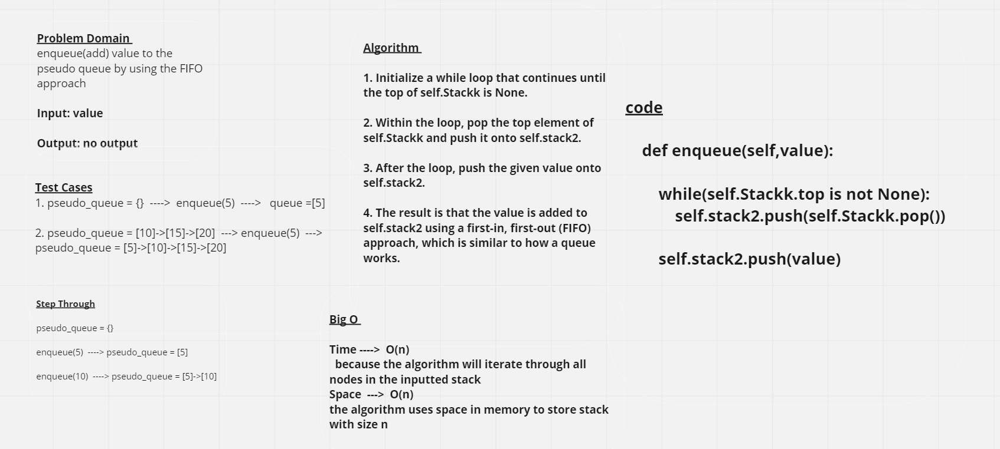
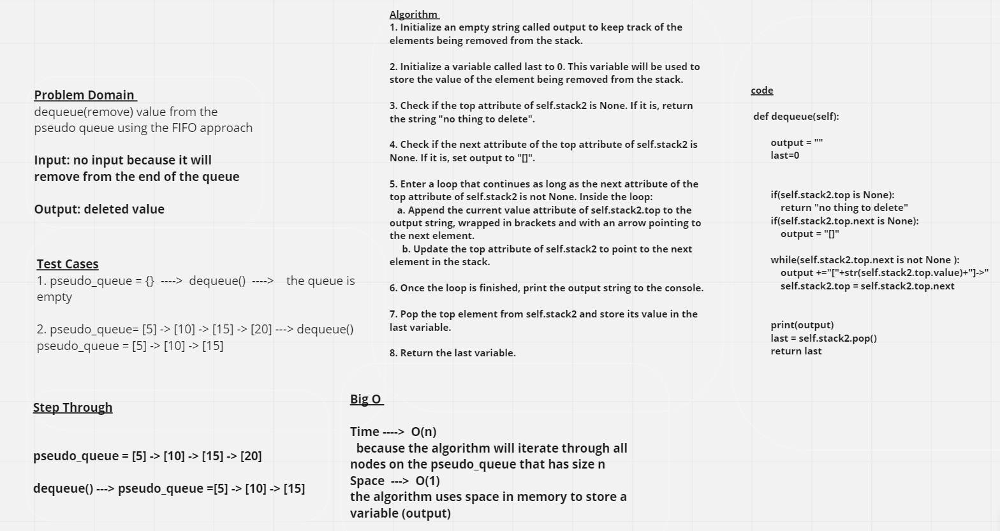

# Linked List Kth

## Whiteboard Process

### Enqueue:

### Dequeue:

## Approach & Efficiency
*The Node class is used to create individual nodes of a Stack or Queue, where each node contains a value and a reference to the next node.*

*The **pseudo_queue** class is used to create and manipulate a queue. It has multiple methods:*

 **enqueue(self,value):** will insert a value into the PseudoQueue, using a first-in, first-out approach which is stack's approach

 **dequeue(self):** will extract(delete) a value from the PseudoQueue, using a first-in, first-out approach which is stack's approach

# Solution 

enqueue(5)   ----> pseudo_queue = [5] -> [10] -> [15] -> [20]
 
dequeue() ----> pseudo_queue =  [5] -> [10] -> [15]

[Pull Request Link]()
                  

 