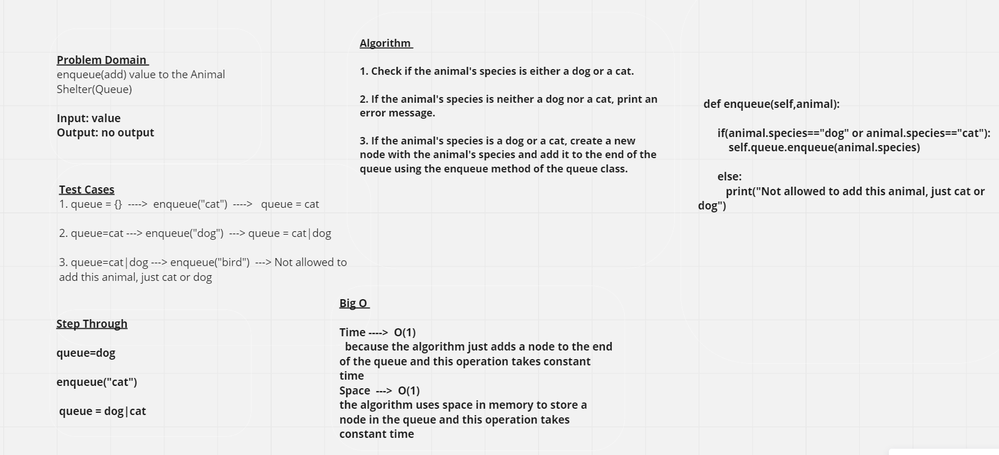
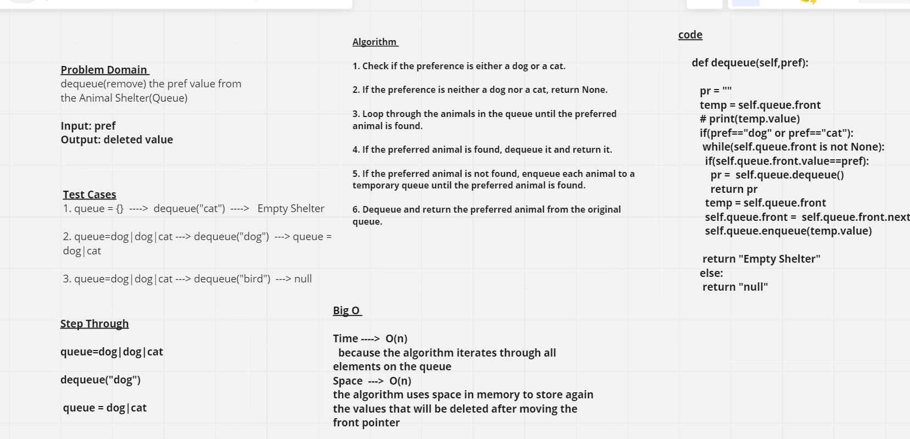

# Animal Shelter

## Whiteboard Process

**Enqueue**

**Dequeue**

## Approach & Efficiency
*The Node class is used to create individual nodes of a Stack or Queue, where each node contains a value and a reference to the next node.*

 *The **Queue** class is used to create and manipulate a queue. It has multiple methods:*

 **enqueue(self,value):** it will add a values each time to the end(back) of the queue

 **dequeue(self,pref):** it will remove the pref whatever it is in the queue

## Solution 

enqueue(dog)
enqueue(dog)
enqueue(dog)
enqueue(cat)
queue = dog|dog|dog|cat

dequeue(dog) ----> queue=dog|dog|cat
dequeue(cat) ----> queue=dog|dog|

[Pull Request Link](https://github.com/DohaKhamaiseh/data-structures-and-algorithms/pull/25)