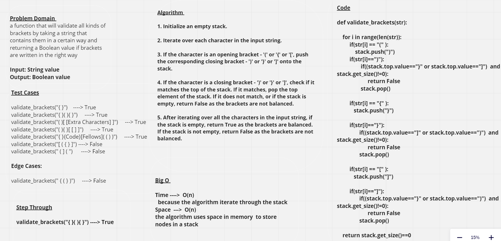

# Multi-bracket Validation

## Whiteboard Process

## Approach & Efficiency

**validate_brackets(str):** this function will validate these kinds of brackets by taking a string that contain them in a certain way and returning a boolean value if brackets are written in the right way

`Round Brackets : ()`

`Square Brackets : []`

`Curly Brackets: {}`

## Solution 

validate_brackets("{ }") &nbsp;  ----> True

validate_brackets("{ }( ){ }")  &nbsp; ----> True

validate_brackets("( )[ [Extra Characters] ]")  &nbsp; ----> True

validate_brackets("( ){ }[ [ ] ]") &nbsp;  ----> True

validate_brackets("{ }{Code}[Fellows]( ( ) )") &nbsp;  ----> True

validate_brackets("[ ( { } ]")  &nbsp; ----> False

validate_brackets(" ( ] ( ")  &nbsp;  ----> False  

validate_brackets(" { ( } )")   &nbsp; ----> False

 

[Pull Request Link](https://github.com/DohaKhamaiseh/data-structures-and-algorithms/pull/27)

