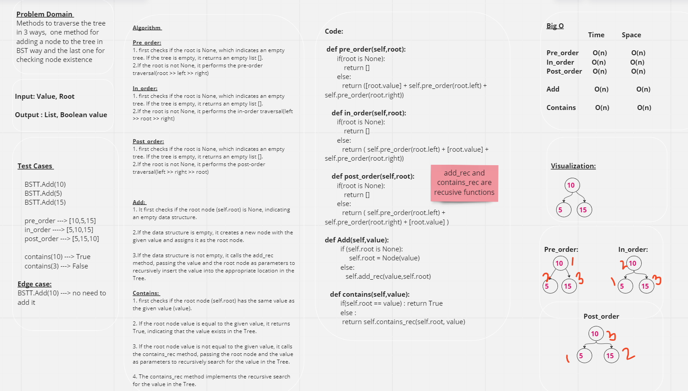
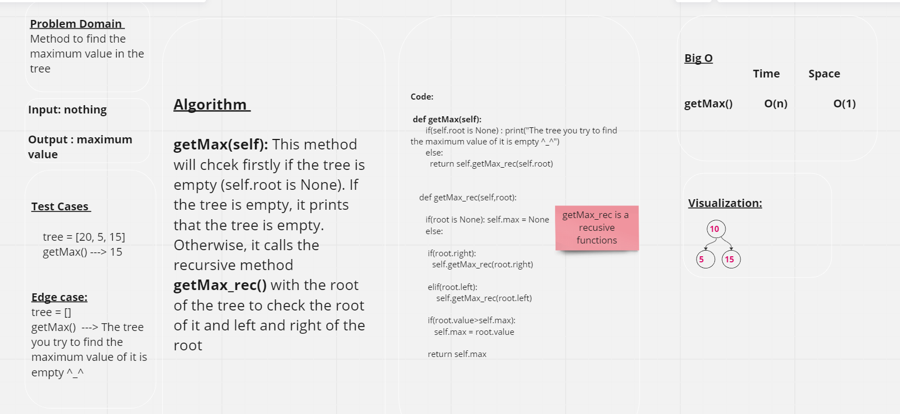

# Trees

## Whiteboard Process





## Approach & Efficiency
*The **Node** class is used to create individual nodes of a Tree, where each node contains a value and a reference to the right and left nodes.*

*The **BinaryTree** class is used to create and manipulate a tree. It has multiple methods to traverse a binary tree:*

**pre_order(self,root):** this method will traverse the tree in this way : root >>> left >>> right

**in_order(self,root):** this method will traverse the tree in this way : left >>> root >>> right

**post_order(self,root):** this method will traverse the tree in this way : left >>> right >>> root

**getMax(self):** this method will return the maximum value in the tree

**tree_breadth_first(self,root):** this method will traverse the tree nodes by levels (tree breadth first way)


*The **BST** class is used to add nodes to the tree but in binary search way which  will put the value that bigger than the root on the right and the smaller on the left . It has multiple methods :*

  **Add(self,value):** this method will add nodes by putting the value that bigger than the root on the right and the smaller on the left

  **contains(self,value):** this method will check if the value is in the tree or not (returning boolean value)


## Solution 
```

    BSTT.Add(10)
    BSTT.Add(5)
    BSTT.Add(15)
     
    pre_order ---> [10,5,15]
    in_order ----> [5,10,15]
    post_order ---> [5,15,10]

    contains(10) ---> True
    contains(3) ---> False

    getMax() ---> 15

    tree_breadth_first(root) ----> [2, 7, 5, 2, 6, 9, 5, 11, 4] 
    tree_breadth_first(root) ----> [10,5,15]

```


<br/>

[Pull Request Link](https://github.com/DohaKhamaiseh/data-structures-and-algorithms/pull/33)