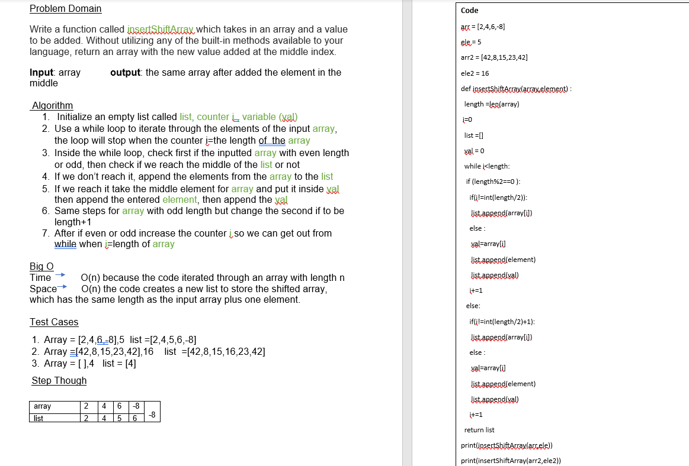

# insert Shift Array

## Whiteboard Process

## Approach & Efficiency
*we are using a loop that iterates through each element of the input array once, and in each iteration, we append the current element to a new array while the index of the new array is not the middle one, if it is the middle we append an entered element. This means that the time it takes to iterate through the inputted array is directly proportional to the length of the array, which is why the time complexity is O(n), where n is the length of the input array.
Additionally, we are creating a new array to store the elements of the input array and the entered element, and the size of this array is equal to the size of the input array +1. This means that the space required to insert Shift the array is also proportional to the length of the input array +1, but the space used by the inserted variable is negligible compared to the space used by the new list. so the space complexity is also O(n).*

## Solution
1.	Array = [2,4,6,-8],5  list =[2,4,5,6,-8]
2.	Array =[42,8,15,23,42],16    list  =[42,8,15,16,23,42]
3.	Array = [ ],4   list = [4] 

