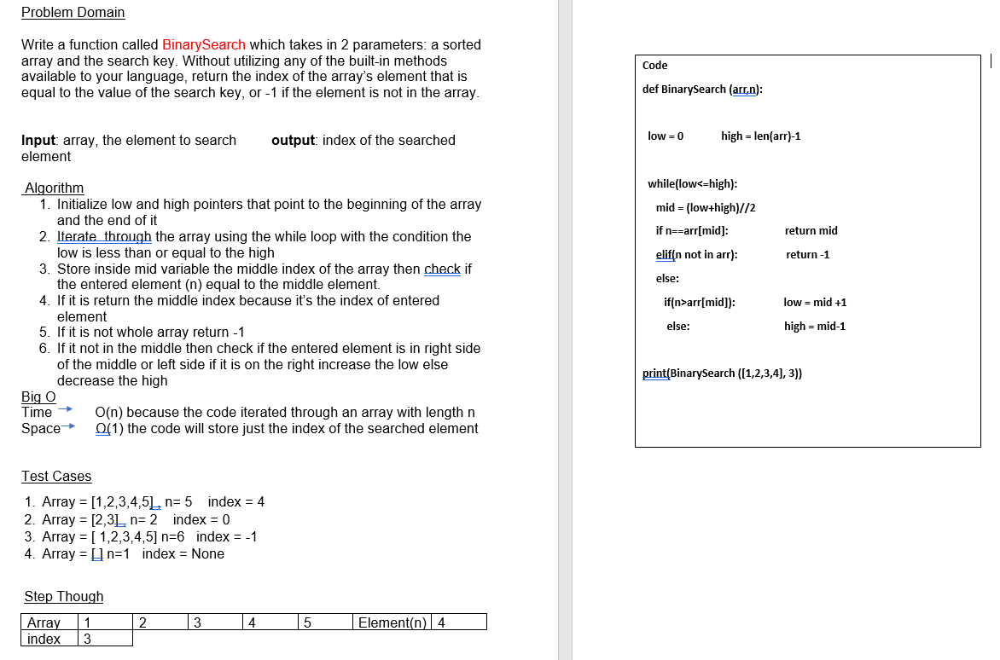

# Array Binary Search

## Whiteboard Process

## Approach & Efficiency
*we are using a While that iterates through each element of the input array oand in each iteration, we compare the index of the searched element with the middle index, if it is the middle just return its index else increase the low index if the search element is bigger than the element in the middle else decrease the high index  . This means that the time it takes to iterate through the inputted array is directly proportional to the length of the array, which is why the time complexity is O(n), where n is the length of the input array.*

*Additionally, we are creating one variable to store the index of searched element. . so the space complexity is also O(1).*

## Solution 

1.	Array = [1,2,3,4,5] , n= 5    index = 4
2.	Array = [2,3] , n= 2    index = 0
3.	Array = [ 1,2,3,4,5] n=6   index = -1 
4.	Array = [ ] n=1   index = None 
