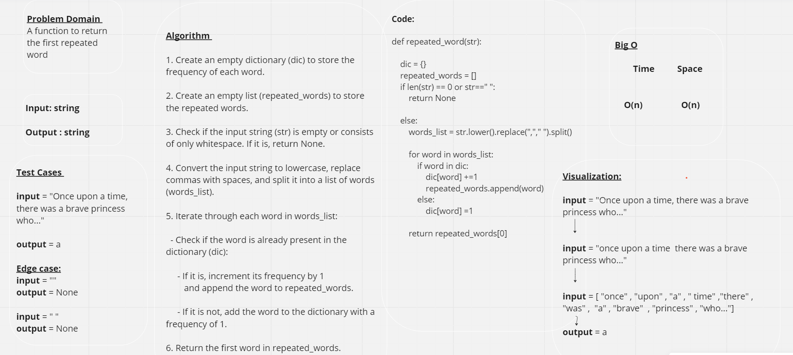

# Hash Map

## Approach & Efficiency

**repeated_word(str):** A function that will calculate the repeated words in a list (after convert string) and then return the first repeated word

 

## Complexity:
#### Time : O(n)

#### Space : O(n)

 

## WhiteBoard : 

 

## Pull Request: [PR](https://github.com/DohaKhamaiseh/data-structures-and-algorithms/pull/51)