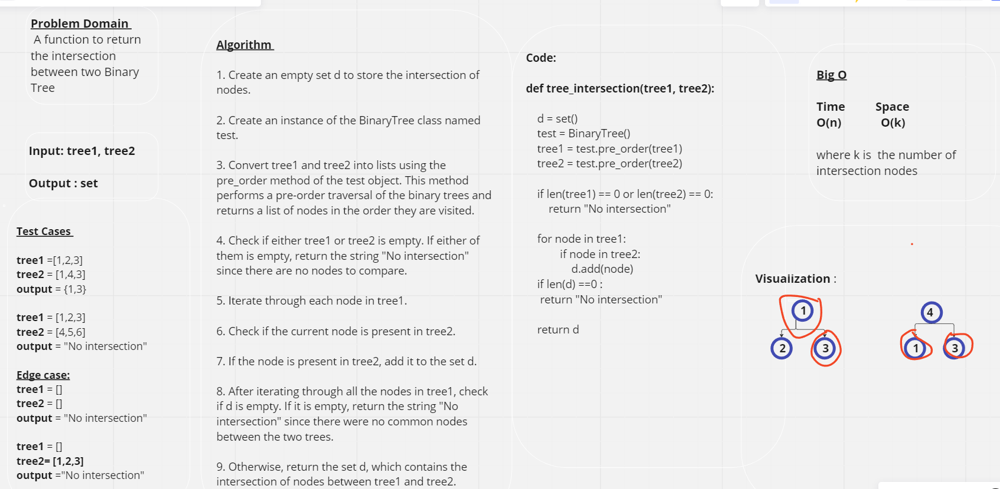

# Hash Map

## Approach & Efficiency

**tree_intersection(tree1.root,tree2.root):**  A function to return the intersection between two Binary Tree

 

## Complexity:
#### Time : O(n)

#### Space : O(k) where k is  the number of intersection nodes

 

## WhiteBoard : 

 

## Pull Request: [PR](https://github.com/DohaKhamaiseh/data-structures-and-algorithms/pull/53)