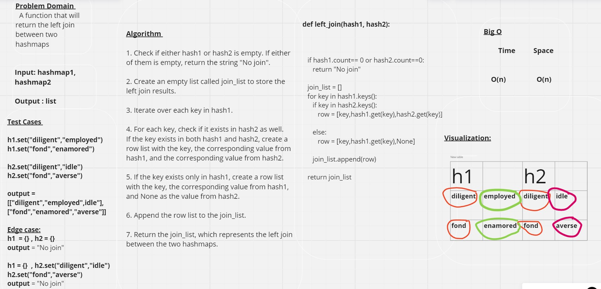

# Left Join

## Approach & Efficiency

**left_join(hash1, hash2):**   A function that will return the left join between two hashmaps

 

## Complexity:
#### Time : O(n)

#### Space : O(n) 
 

## WhiteBoard : 

 

## Pull Request: [PR](https://github.com/DohaKhamaiseh/data-structures-and-algorithms/pull/61)