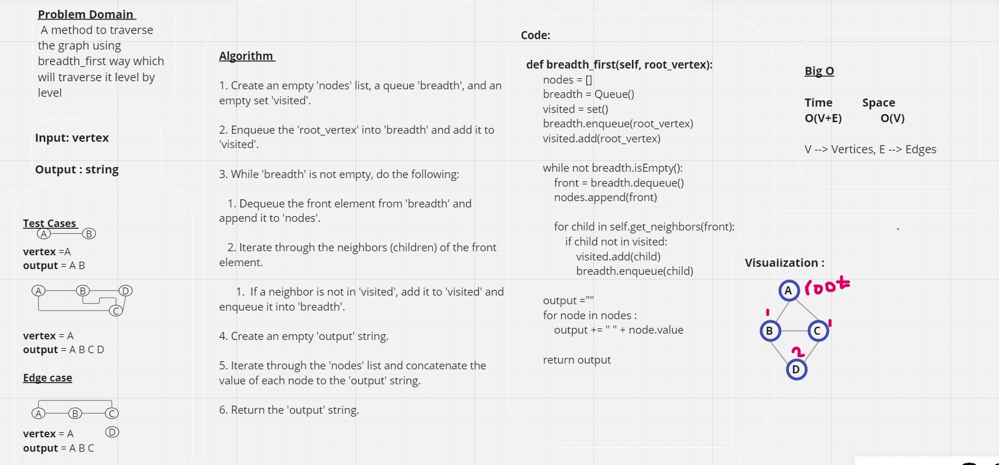
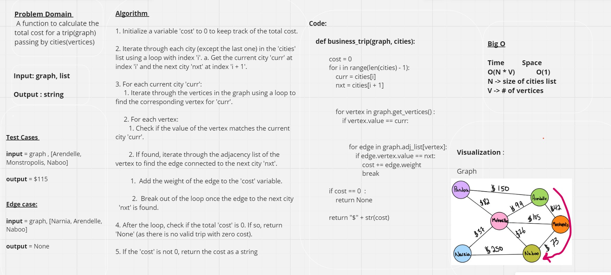

# Graph

## Whiteboard

## Approach & Efficiency

*The **Graph** class is used to create and manipulate a undirect graph. It has multiple methods :*

**add_vertex(self, value)**  A method to add a vertex to the adjacency list

**add_edge(self,vertex1, vertex2):**    A method to add an edge between two vertices

**get_vertices(self):**      A method to get all vertices in the adjacency list

**get_neighbors(self,vertex):**   A method to get all neighbors for the given vertex

**get_size(self):**   A method to get the size of the adjacency list which is the total number of the vertices

**breadth_first(self, root_vertex):**    A method to traverse the graph using breadth_first way which will traverse it level by level

**business_trip(graph, cities):**   A function to calculate the total cost for a trip(graph) passing by cities(vertices)

## Complexity:

| Method        | Time | Space |
|--------       |------|-------|
| add_vertex    | O(1) | O(1)  |
| add_edge      | O(1) | O(1)  |
| get_vertices  | O(V) | O(1)  |
| get_neighbors | O(1) | O(1)  |
| get_size      | O(1) | O(1)  |
| breadth_first | O(V + E) | O(V)  |  
| business_trip | O(N * V) | O(1)  |
V ---> Vertices , E --> Edges , N ---> # of cities

## Pull Request: [PR](https://github.com/DohaKhamaiseh/data-structures-and-algorithms/pull/67)