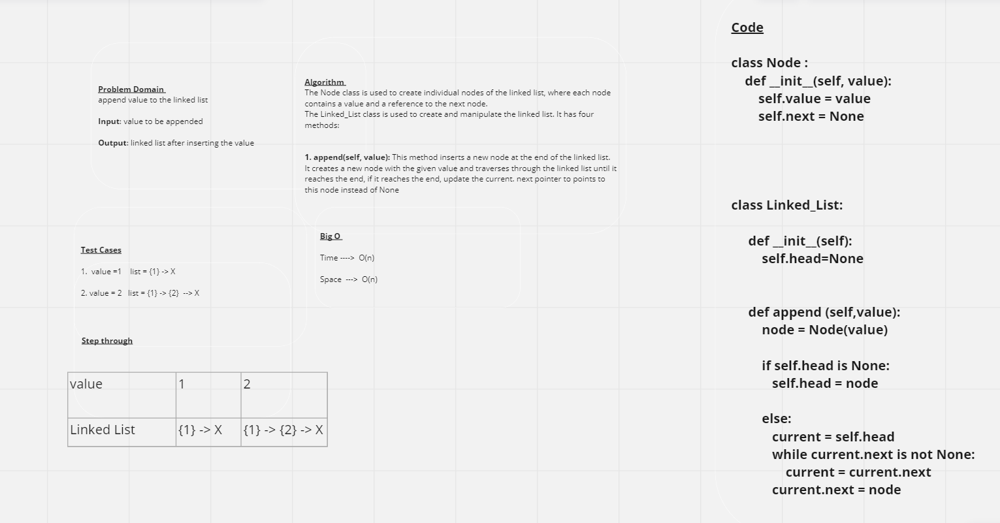
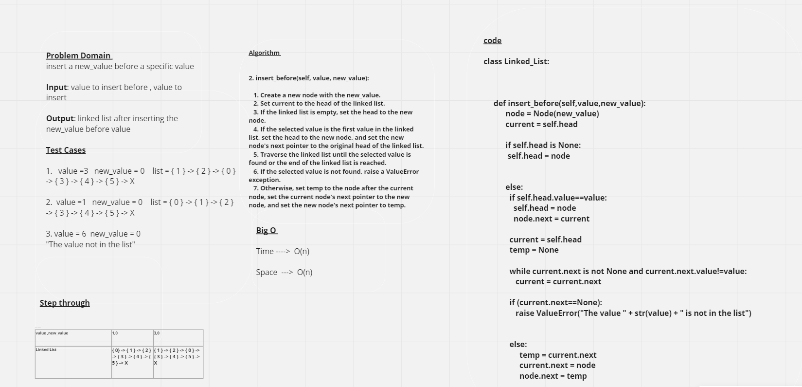
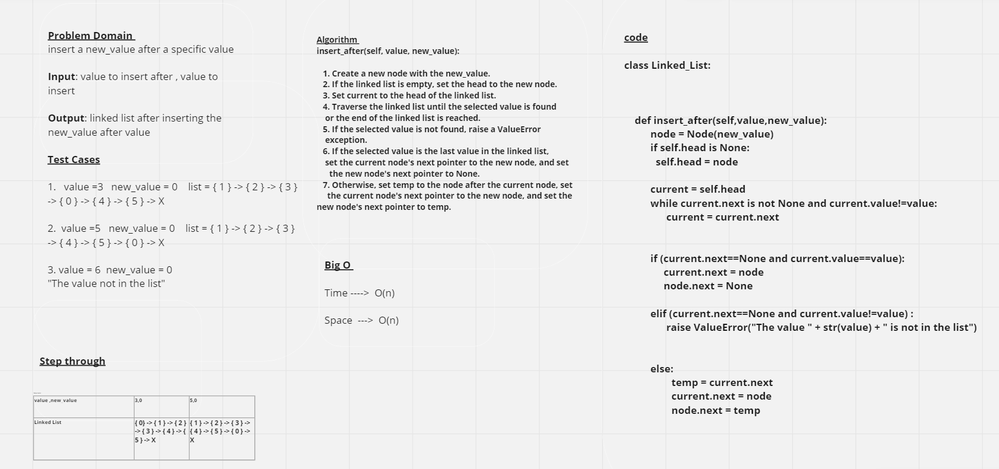

# Linked List Insertions

## Whiteboard Process
### Method_1
 

 **in case it is not clear:**
 [CC6_1 In Miro](https://miro.com/app/board/uXjVMSGNd2I=/)

### Method_2

**in case it is not clear:**
[CC6_2 In Miro](https://miro.com/app/board/uXjVMSEM90s=/)

### Method_3

**in case it is not clear:**
[CC6_3 In Miro](https://miro.com/app/board/uXjVMSNcTAw=/)
 
## Approach & Efficiency
*The Node class is used to create individual nodes of the linked list, where each node contains a value and a reference to the next node.*

*The Linked_List class is used to create and manipulate the linked list. It has four methods:*

1. **append(self, value)**: This method inserts a new node at the end of the linked list. It creates a new node with the given value and traverses through the linked list until it reaches the end, if it reaches the end, update the current. next pointer to points to this node instead of None

2. **insert_before(self, value, new_value)**:

   1. Create a new node with the new_value.
   2. Set current to the head of the linked list.
   3. If the linked list is empty, set the head to the new node.
   4. If the selected value is the first value in the linked 
     list, set the head to the new node, and set the new node's 
      next pointer to the original head of the linked list.
   5. Traverse the linked list until the selected value is found 
     or the end of the linked list is reached.
   6. If the selected value is not found, raise a ValueError 
    exception.
   7. Otherwise, set temp to the node after the current node, set 
    the current node's next pointer to the new node, and set the 
     new node's next pointer to temp.

3. **insert_after(self, value, new_value)**:

   1. Create a new node with the new_value.
   2. If the linked list is empty, set the head to the new node.
   3. Set current to the head of the linked list.
   4. Traverse the linked list until the selected value is found 
    or the end of the linked list is reached.
   5. If the selected value is not found, raise a ValueError 
    exception.
   6. If the selected value is the last value in the linked list, 
    set the current node's next pointer to the new node, and set 
      the new node's next pointer to None.
   7. Otherwise, set temp to the node after the current node, set 
     the current node's next pointer to the new node, and set the 
      new node's next pointer to temp.

## Solution 

1.	value =1    list = {1} -> X
2.	insert before : value =3   new_value = 0    list = { 1 } -> { 2 } -> { 0 } -> { 3 } -> { 4 } -> { 5 } -> X
3.	insert after :  value =3   new_value = 0    list = { 1 } -> { 2 } -> { 3 } -> { 0 } -> { 4 } -> { 5 } -> X
4.	insert before : value =1   new_value = 0    list = { 0 } -> { 1 } -> { 2 } -> { 3 } -> { 4 } -> { 5 } -> X
5.	insert after :  value =5   new_value = 0    list = { 1 } -> { 2 } -> { 3 } -> { 4 } -> { 5 } -> { 0 } -> X
6.	insert before :  value =6   new_value = 0   "The value 6 not in the list"
7.	insert after :  value =6   new_value = 0    "The value 6 not in the list"

[Pull Request Link](https://github.com/DohaKhamaiseh/data-structures-and-algorithms/pull/7)