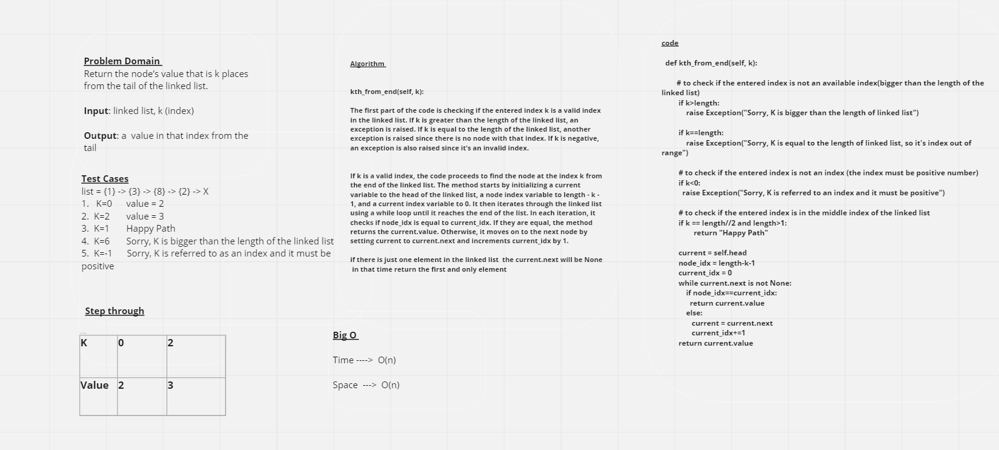

# Linked List Kth

## Whiteboard Process

## Approach & Efficiency
*The Node class is used to create individual nodes of the linked list, where each node contains a value and a reference to the next node.*

*The Linked_List class is used to create and manipulate the linked list. It has one new method:*

**kth_from_end(self, k)**: This method will return the node's value that is k places from the tail of the linked list. in details:
1. Initialize a variable 'current' to the head of the linked list and an empty list 'list' to store each node's value.

2. Traverse the linked list using a while loop until the current node is not None. 
    *  Append the value of the current node to the list.
    * Set the current node to the next node in the linked list.

3. Append the value of the last node in the linked list to the list.
   
4. Reverse the list using the slicing notation list[::-1], and store it in a new list called 'rev_list'.

5. Check if the given index 'k' is out of range or negative using if statements. If it is, raise an exception.

6. Iterate through the reversed list using a for loop, and for each element in the list, do the following:
    * Get the index of the element in the reversed list using the index() method.
     * If the index is equal to the given index 'k', return the value of the element.
     * If the index is in the middle of the reversed list (i.e., len(rev_list)//2), return "Happy Path".

7. If the given index 'k' is not found in the reversed list, it means it is out of range, so raise an exception.

## Solution 

list = {1} -> {3} -> {8} -> {2} -> X
1.  K=0      value = 2
2.  K=2       value = 3
3.  K=1       Happy Path
4.  K=6       Sorry, K is bigger than the length of the linked list
5.  K=-1      Sorry, K is referred to as an index and it must be positive

[Pull Request Link](https://github.com/DohaKhamaiseh/data-structures-and-algorithms/pull/9)

