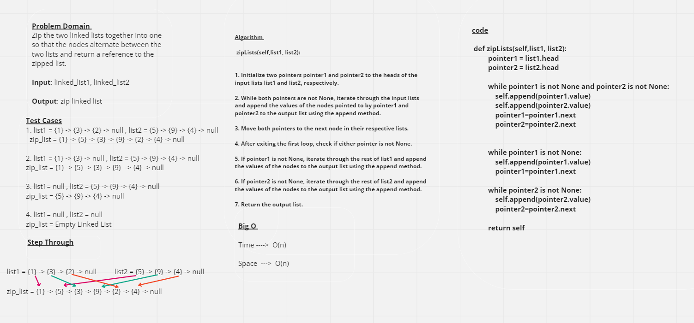

# Linked List Zip

## Whiteboard Process

## Approach & Efficiency
*The Node class is used to create individual nodes of the linked list, where each node contains a value and a reference to the next node.*

*The Linked_List class is used to create and manipulate the linked list. It has one new method:*

**zipLists(self,list1, list2):**

1. Initialize two pointers pointer1 and pointer2 to the heads of the input lists list1 and list2, respectively.

2. While both pointers are not None, iterate through the input lists and append the values of the nodes pointed to by pointer1 and pointer2 to the output list using the append method.

3. Move both pointers to the next node in their respective lists.

4. After exiting the first loop, check if either pointer is not None.

5. If pointer1 is not None, iterate through the rest of list1 and append the values of the nodes to the output list using the append method.

6. If pointer2 is not None, iterate through the rest of list2 and append the values of the nodes to the output list using the append method.

7. Return the output list.

## Solution 

1. list1 = {1} -> {3} -> {2} -> null , list2 = {5} -> {9} -> {4} -> null
  zip_list = {1} -> {5} -> {3} -> {9} -> {2} -> {4} -> null

2. list1 = {1} -> {3} -> null , list2 = {5} -> {9} -> {4} -> null
zip_list = {1} -> {5} -> {3} -> {9}  -> {4} -> null

3. list1= null , list2 = {5} -> {9} -> {4} -> null
zip_list = {5} -> {9} -> {4} -> null

4. list1= null , list2 = null
zip_list = Empty Linked List

[Pull Request Link]()
