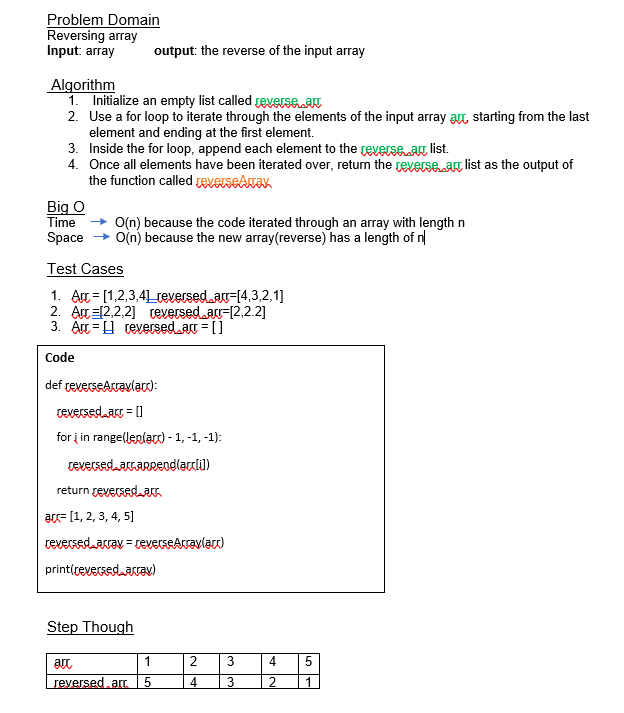

# Reverse Array

## Whiteboard Process

## Approach & Efficiency
*we are using a loop that iterates through each element of the input array once, and in each iteration, we append the current element to a new array. This means that the time it takes to reverse the array is directly proportional to the length of the array, which is why the time complexity is O(n), where n is the length of the input array.
Additionally, we are creating a new array to store the reversed elements of the input array, and the size of this array is equal to the size of the input array. This means that the space required to reverse the array is also proportional to the length of the input array, so the space complexity is also O(n).*

## Solution
1.	Arr = [1,2,3,4]  reversed_arr=[4,3,2,1]
2.	Arr =[2,2,2]    reversed_arr=[2,2.2]
3.	Arr = [ ]   reversed_arr = [ ] 
