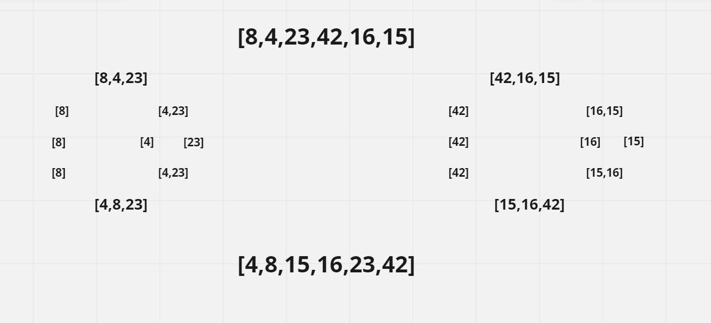

### Pseudocode


```
ALGORITHM Mergesort(arr)
    DECLARE n <-- arr.length

    if n > 1
      DECLARE mid <-- n/2
      DECLARE left <-- arr[0...mid]
      DECLARE right <-- arr[mid...n]
      // sort the left side
      Mergesort(left)
      // sort the right side
      Mergesort(right)
      // merge the sorted left and right sides together
      Merge(left, right, arr)

ALGORITHM Merge(left, right, arr)
    DECLARE i <-- 0
    DECLARE j <-- 0
    DECLARE k <-- 0

    while i < left.length && j < right.length
        if left[i] <= right[j]
            arr[k] <-- left[i]
            i <-- i + 1
        else
            arr[k] <-- right[j]
            j <-- j + 1

        k <-- k + 1

    if i = left.length
       set remaining entries in arr to remaining values in right
    else
       set remaining entries in arr to remaining values in left

  ```

### Trace
#### Sample Arrays
  input array = [8,4,23,42,16,15]

  

### Pass1: 
n = 6 , mid = 6//2= 3, left =[8,4,23] , right = [42,16,15]

### Pass2:
first left will be splitted : n=3 mid =3//2=1 , left = [8] , right=[4,23]

### Pass3:
left will not be splitted because n=1, we will split the right because n =2 so right=[4,23]

### Pass4:
left = [4] with right = [23], we will not split anymore bacause n=1

### Pass5:
merge left with right after sorting so arr =[4,23]

### Pass6:
merge left = [8] with right = [4,23] after sorting so arr = [4,8,23], we finished the left side of original array now we will work with right side

### pass7:
arr = [42,16,15] , n=3 , mid = 3//2 = 1 , left = [42] , right = [16,15]


### Pass8:
left will not be splitted because n=1, we will split the right because n =2 so right=[16,15]

### Pass9:
left = [16] with right = [15], we will not split anymore bacause n=1

### Pass10:
merge left with right after sorting so arr =[15,16]

### Pass11:
merge left = [42] with right = [15,16] after sorting so arr = [15,16,42]

### Pass12:
merge left side of original array with right side after sorting so arr = [4,8,15,16,23,42]

[PR link]()